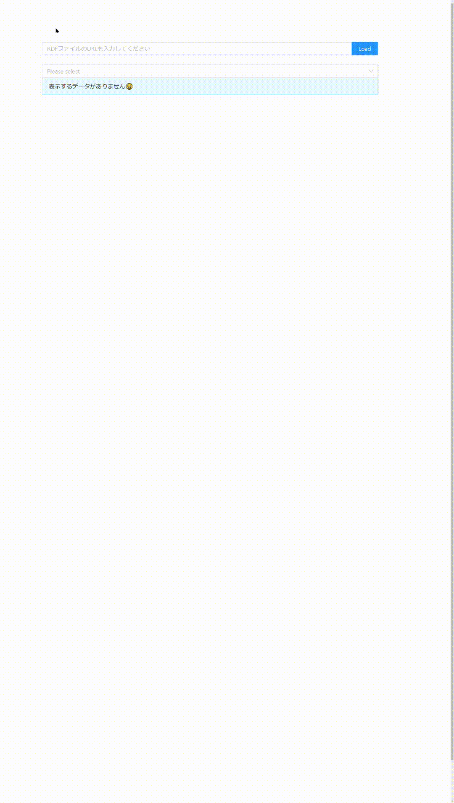

# ACM CCSを使った文献検索

## 必要なもの
### フロントエンド
- node v16.13.1
- package.jsonに書かれているパッケージたち

### バックエンド
- python 3.8
- requirements.txtに書かれているパッケージたち
- acm ccsのrdfファイル（backend/utilsに配置されている）

## セットアップ
```bash
git clone kore
cd search4papers-from-bibtexRDF
```
### フロントエンド
```bash
cd frontend/app
npm install
```

### バックエンド
```bash
cd backend
python -m venv venv
source venv/bin/activate
pip install pip -U
pip install -r requirements.txt
```

## 起動方法
それぞれ別のターミナルで動かしてください．
### フロントエンド
```bash
cd frontend/app
npm run start
```
初期設定では，ウェブブラウザで`localhost:3000`にアクセスするとページが開きます．  

### バックエンド
```bash
cd backend
source venv/bin/activate
python server.py
```
初期設定では，`localhost:5000`でWeb APIが動きます．

## 使い方
[こちら](https://github.com/s246wv/ISARC-bibtex-rdf/tree/main/acm_ccs_emb)を参考に，ACM CCSと紐づけ済みのbibtexRDFファイルを作成し，指定してください．例：`https://raw.githubusercontent.com/s246wv/ISARC-bibtex-rdf/main/isarc/2022/isarc2022withACMCSS.bib.ttl`入力したらLoadボタンを押してください．  
server.pyが適切に動いていれば，SelectorをクリックするとACM CCSのタクソノミーが表示されます．語の左の黒い矢印をクリックすると，下位に分類された語が展開されます．語のラベルをクリックすると，その語が選択されます．選択された語と類似キーワードを含む文献があれば，そのリストのテーブルが下に表示されます．  

下にスクリーンキャプチャを示します．  


## 既知の問題
- ファイルアップロードに対応していません．
- ACM CCSの下位の語を都度SPARQLで検索しておりお待たせしています．
- 展開したときに語が葉であるかを分かりません．展開してみて初めてそれが葉であることをわかります．
- 語の展開をしてそれが葉であることが分かったとき，その語は木の同じ深さの最後に移動します．
- RDFファイルに想定したプロパティがない場合には機能しません．
- スクリーンキャプチャが縦長すぎる。。

# 謝辞
[ACM Computing Classification System](https://dl.acm.org/ccs)